# CI/CD実装計画書

**作成日時**: 2026-01-31 23:49:47 PST
**ドキュメントバージョン**: 1.0
**ステータス**: 承認待ち

---

## 1. 概要

### 1.1 目的

X予約投稿システムのGitHub Actionsワークフローを作成し、以下を実現する:
- 定期的な投稿実行（5分間隔のcronジョブ）
- Web UIの自動デプロイ（GitHub Pages）
- テスト自動実行（PRおよびmainへのpush時）
- データバリデーション（PR時）
- 依存関係自動更新（Dependabot）

### 1.2 スコープ

| 範囲 | 内容 |
|------|------|
| **対象** | .github/workflows/ 配下のワークフローファイル |
| **インフラ** | GitHub Actions（無料枠: 2,000分/月） |
| **デプロイ先** | GitHub Pages（静的サイト） |

---

## 2. ワークフロー設計

### 2.1 全体構成図

```mermaid
graph TB
    subgraph "定期実行"
        A[Cron: */5 * * * *] --> B[schedule.yml]
        B --> C[Python Scheduler]
        C --> D[X API投稿]
        D --> E[posts.json更新]
        E --> F[Git Commit & Push]
    end

    subgraph "デプロイ"
        G[Push to main] --> H[deploy.yml]
        H --> I[Next.js Build]
        I --> J[GitHub Pages Deploy]
    end

    subgraph "テスト"
        K[PR/Push] --> L[test.yml]
        L --> M[Python Tests]
        L --> N[Web Tests]
        L --> O[Data Validation]
    end

    subgraph "バリデーション"
        P[PR: posts.json変更] --> Q[validate.yml]
        Q --> R[Schema Validation]
    end

    subgraph "依存関係"
        S[Weekly] --> T[dependabot.yml]
        T --> U[pip/npm/actions更新]
    end
```



### 2.2 ワークフロー一覧

| ファイル | トリガー | 目的 | 実行時間目安 |
|---------|---------|------|-------------|
| `schedule.yml` | cron: */5, workflow_dispatch | 予約投稿の定期実行 | 30秒-2分 |
| `deploy.yml` | push: main (web/**), workflow_dispatch | Web UIデプロイ | 3-5分 |
| `test.yml` | push, pull_request | テスト実行 | 2-4分 |
| `validate.yml` | pull_request (data/**) | データバリデーション | 10-30秒 |
| `dependabot.yml` | weekly | 依存関係更新PR作成 | - |

---

## 3. 各ワークフローの詳細設計

### 3.1 schedule.yml（定期実行）

#### トリガー条件
```yaml
on:
  schedule:
    - cron: '*/5 * * * *'  # 5分ごと
  workflow_dispatch:        # 手動実行も可能
    inputs:
      dry_run:
        description: 'Dry run (no actual posting)'
        required: false
        default: 'false'
        type: boolean
```

#### ステージ構成

| ステージ | 内容 | 所要時間 |
|---------|------|---------|
| Checkout | リポジトリ取得 | 5秒 |
| Setup Python | Python 3.11 + キャッシュ | 10-30秒 |
| Install dependencies | pip install | 10-20秒 |
| Run scheduler | 投稿処理実行 | 10-60秒 |
| Commit changes | posts.json更新をコミット | 5-10秒 |

#### シークレット要件

| シークレット名 | 用途 |
|--------------|------|
| `X_CLIENT_ID` | X OAuth認証 |
| `X_CLIENT_SECRET` | X OAuth認証 |
| `X_ACCESS_TOKEN` | X API呼び出し |
| `X_REFRESH_TOKEN` | トークン更新 |

#### パーミッション
```yaml
permissions:
  contents: write  # posts.jsonへのコミットに必要
```

#### エラーハンドリング
- Python実行失敗時: ワークフロー失敗、GitHub通知
- git push失敗時: ワークフロー失敗、再実行可能

---

### 3.2 deploy.yml（Web UIデプロイ）

#### トリガー条件
```yaml
on:
  push:
    branches: [main]
    paths:
      - 'web/**'                    # Web関連のみ
      - '.github/workflows/deploy.yml'
  workflow_dispatch:
```

#### ステージ構成

| ステージ | 内容 | 所要時間 |
|---------|------|---------|
| Checkout | リポジトリ取得 | 5秒 |
| Setup Node.js | Node.js 20 + キャッシュ | 10-30秒 |
| Install dependencies | npm ci | 30-60秒 |
| Build | Next.js Static Export | 60-120秒 |
| Upload artifact | Pages用アーティファクト | 10-20秒 |
| Deploy | GitHub Pagesへデプロイ | 30-60秒 |

#### パーミッション
```yaml
permissions:
  contents: read
  pages: write
  id-token: write
```

#### 環境変数
```yaml
env:
  NEXT_PUBLIC_GITHUB_REPO: ${{ github.repository }}
```

---

### 3.3 test.yml（テスト実行）

#### トリガー条件
```yaml
on:
  push:
    branches: [main]
  pull_request:
    branches: [main]
```

#### ジョブ構成

| ジョブ | 内容 | 並列実行 |
|--------|------|---------|
| `test-python` | Pythonテスト + カバレッジ | Yes |
| `test-web` | Lint + Webテスト | Yes |
| `validate-data` | posts.json構文チェック | Yes |

#### test-python
- pytest実行
- カバレッジレポート生成（XML）
- Codecovへアップロード

#### test-web
- ESLint実行
- Jestテスト実行（--passWithNoTests）
- カバレッジ出力

#### validate-data
- JSON構文チェック
- 基本的な読み込み確認

---

### 3.4 validate.yml（PRバリデーション）

#### トリガー条件
```yaml
on:
  pull_request:
    branches: [main]
    paths:
      - 'data/posts.json'
```

#### バリデーション項目

| 検証内容 | エラー時の動作 |
|---------|---------------|
| JSON構文チェック | PR失敗 |
| スキーマ検証（config/posts/history/stats） | PR失敗 |
| 日時フォーマット検証（ISO 8601） | PR失敗 |
| typeフィールド検証（tweet/thread/repost） | PR失敗 |
| interval_minutes検証（5/15/30/60） | PR失敗 |

#### バリデーションスクリプト
```python
import json
from datetime import datetime

with open('data/posts.json') as f:
    data = json.load(f)

# 必須フィールド検証
assert 'config' in data
assert 'posts' in data
assert 'history' in data
assert 'stats' in data

# 設定値検証
config = data['config']
assert config['interval_minutes'] in [5, 15, 30, 60]

# 投稿データ検証
for post in data['posts']:
    assert 'id' in post
    assert post['type'] in ['tweet', 'thread', 'repost']
    datetime.fromisoformat(post['scheduled_at'].replace('Z', '+00:00'))
```

---

### 3.5 dependabot.yml（依存関係更新）

#### 更新スケジュール

| パッケージエコシステム | ディレクトリ | 頻度 | PR上限 |
|---------------------|------------|------|--------|
| pip | /scheduler | 週次 | 5 |
| npm | /web | 週次 | 5 |
| github-actions | / | 週次 | 5 |

#### 動作
- 毎週月曜日に依存関係をチェック
- 更新がある場合、PRを自動作成
- セキュリティアップデートは優先度高

---

## 4. デプロイ戦略

### 4.1 継続的デプロイ（CD）

```
main branchへのpush
    ↓
deploy.yml トリガー
    ↓
Next.js ビルド（Static Export）
    ↓
GitHub Pages デプロイ
    ↓
https://<username>.github.io/<repo>/
```

### 4.2 ロールバック戦略

| シナリオ | 対応 |
|---------|------|
| デプロイ失敗 | 前回のデプロイが保持される（自動ロールバック） |
| ビルドエラー | ワークフロー失敗、mainは影響なし |
| Web UI不具合 | git revert + 再デプロイ |

---

## 5. セキュリティ

### 5.1 シークレット管理

```
GitHub Settings → Secrets and variables → Actions
    ├── X_CLIENT_ID (暗号化保存)
    ├── X_CLIENT_SECRET (暗号化保存)
    ├── X_ACCESS_TOKEN (暗号化保存)
    └── X_REFRESH_TOKEN (暗号化保存)
```

### 5.2 パーミッション最小化原則

| ワークフロー | 必要なパーミッション | 理由 |
|------------|-------------------|------|
| schedule.yml | contents: write | posts.json更新 |
| deploy.yml | pages: write, id-token: write | Pagesデプロイ |
| test.yml | contents: read | リポジトリ読み取りのみ |
| validate.yml | contents: read | リポジトリ読み取りのみ |

### 5.3 [skip ci] 対策

```bash
git commit -m "chore: update posts status [skip ci]"
```

- schedule.ymlのコミットは無限ループを防ぐため`[skip ci]`を付与
- これにより、投稿ステータス更新時にワークフローが再トリガーされない

---

## 6. 監視・アラート

### 6.1 ワークフロー失敗時の通知

| 通知先 | 条件 |
|-------|------|
| GitHubメール | すべてのワークフロー失敗 |
| Actionsタブ | ワークフロー実行履歴 |

### 6.2 モニタリング指標

| 指標 | 確認方法 |
|------|---------|
| ワークフロー成功率 | Actions → schedule.yml |
| 月間実行時間 | Settings → Billing |
| テストカバレッジ | Codecov（統合後） |

---

## 7. コスト見積もり

### 7.1 GitHub Actions使用量

| ワークフロー | 実行頻度 | 実行時間 | 月間使用時間 |
|------------|---------|---------|-------------|
| schedule.yml | 288回/日 | 1分 | 8,640分 |
| deploy.yml | 5回/週 | 4分 | 80分 |
| test.yml | 30回/月 | 3分 | 90分 |
| validate.yml | 10回/月 | 0.5分 | 5分 |
| **合計** | - | - | **8,815分/月** |

**注意**: 無料枠は2,000分/月のため、超過する可能性が高い。

### 7.2 コスト削減策

| 対策 | 削減効果 |
|------|---------|
| cronを15分間隔に変更 | -75%（2,160分/月） |
| cronを30分間隔に変更 | -87.5%（1,080分/月） |
| skip ci適用 | 不要な実行を防止 |
| キャッシュ活用 | セットアップ時間短縮 |

**推奨**: 初期は15分間隔で運用し、使用量を監視しながら調整

---

## 8. 実装順序

### フェーズ1: 基本ワークフロー（優先度: 高）
1. `.github/workflows/schedule.yml`
2. `.github/workflows/test.yml`
3. `.github/workflows/validate.yml`

### フェーズ2: デプロイ（優先度: 中）
4. `.github/workflows/deploy.yml`

### フェーズ3: 自動化（優先度: 低）
5. `.github/dependabot.yml`

---

## 9. テスト計画

### 9.1 ワークフローテスト

| ワークフロー | テスト方法 |
|------------|-----------|
| schedule.yml | workflow_dispatch（dry_run=true） |
| deploy.yml | workflow_dispatch（手動実行） |
| test.yml | PRを作成して自動実行確認 |
| validate.yml | data/posts.json変更PRで確認 |

### 9.2 検証項目

- [ ] schedule.ymlが5分ごとに実行される
- [ ] dry_runで実際の投稿が行われない
- [ ] posts.json更新が正しくコミットされる
- [ ] deploy.ymlでGitHub Pagesにデプロイされる
- [ ] test.ymlですべてのテストが実行される
- [ ] validate.ymlで不正なJSONが検出される
- [ ] シークレットが正しく参照される

---

## 10. リスク評価

| リスク | 影響度 | 対策 |
|-------|--------|------|
| GitHub Actions使用量超過 | 高 | cronを15分間隔に変更 |
| X API制限超過 | 中 | scheduler側で制限管理 |
| シークレット漏洩 | 高 | GitHub Secretsで暗号化保存 |
| ワークフロー無限ループ | 中 | [skip ci]付与 |
| デプロイ失敗 | 低 | 前バージョン保持 |

---

## 11. 承認後の作業

### 11.1 ファイル作成

```
.github/
├── workflows/
│   ├── schedule.yml
│   ├── deploy.yml
│   ├── test.yml
│   └── validate.yml
└── dependabot.yml
```

### 11.2 シークレット設定

GitHub Repository Settings で以下を設定:
- X_CLIENT_ID
- X_CLIENT_SECRET
- X_ACCESS_TOKEN
- X_REFRESH_TOKEN

### 11.3 GitHub Pages有効化

Settings → Pages → Source: GitHub Actions

---

## 12. 承認

| 役割 | 名前 | 日付 | 署名 |
|------|------|------|------|
| 作成者 | Claude (DevOps Specialist) | 2026-01-31 | - |
| 承認者 | | | |
