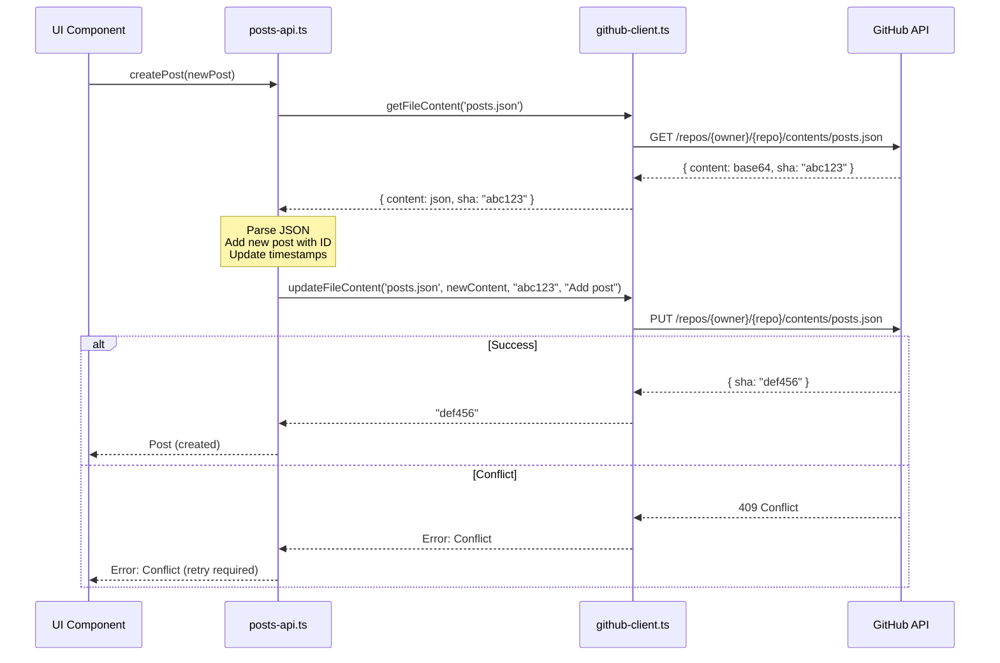
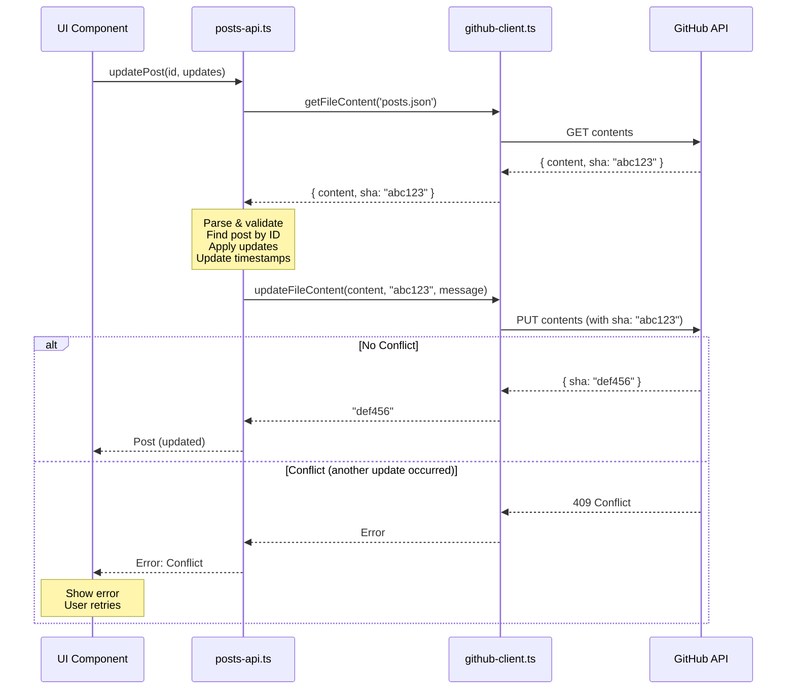

# GitHub API クライアント実装 - 設計書

**作成日時**: 2026-02-01 00:43:16 PST

## 1. アーキテクチャ概要

```
┌─────────────────────────────────────────────────────────────┐
│                        Next.js App                          │
│  ┌─────────────────────────────────────────────────────┐   │
│  │              UI Components/Pages                    │   │
│  └───────────────────────┬─────────────────────────────┘   │
│                          │                                  │
│  ┌───────────────────────▼─────────────────────────────┐   │
│  │         posts-api.ts (High-level API)               │   │
│  │  ┌─────────────────────────────────────────────┐   │   │
│  │  │ - getPosts()      - getHistory()            │   │   │
│  │  │ - getPost()       - getConfig()             │   │   │
│  │  │ - createPost()    - updateConfig()          │   │   │
│  │  │ - updatePost()    - getStats()              │   │   │
│  │  │ - deletePost()                              │   │   │
│  │  └─────────────────────┬───────────────────────┘   │   │
│  └────────────────────────┼───────────────────────────┘   │
│                           │                                 │
│  ┌────────────────────────▼───────────────────────────┐   │
│  │      github-client.ts (Low-level API)             │   │
│  │  ┌────────────────────────────────────────────┐   │   │
│  │  │ - getFileContent()                         │   │   │
│  │  │ - updateFileContent()                      │   │   │
│  │  │ - createBlob()                             │   │   │
│  │  └────────────────────┬───────────────────────┘   │   │
│  └─────────────────────────┼─────────────────────────┘   │
│                            │                               │
│  ┌─────────────────────────▼─────────────────────────┐   │
│  │              @octokit/rest                        │   │
│  └─────────────────────────┬─────────────────────────┘   │
└────────────────────────────┼───────────────────────────────┘
                             │
                             ▼
                    ┌─────────────────┐
                    │   GitHub API    │
                    │   (posts.json)  │
                    └─────────────────┘
```

### レイヤー責務

| レイヤー | 責務 | 依存関係 |
|---------|------|----------|
| **posts-api.ts** | ビジネスロジック、データ変換、楽観的更新 | github-client.ts, types/index.ts |
| **github-client.ts** | GitHub API操作、認証、エラーハンドリング | @octokit/rest, next-auth |
| **@octokit/rest** | GitHub REST API クライアント | GitHub API |

## 2. データフロー

### 2.1 投稿作成フロー



### 2.2 投稿更新フロー（楽観的ロック）



## 3. クラス設計

### 3.1 github-client.ts

```typescript
interface GitHubClientConfig {
  owner: string;
  repo: string;
  token: string;
}

interface FileContent {
  content: string;
  sha: string;
}

class GitHubClient {
  private octokit: Octokit;
  private owner: string;
  private repo: string;

  constructor(config: GitHubClientConfig);

  async getFileContent(path: string): Promise<FileContent | null>;
  async updateFileContent(
    path: string,
    content: string,
    sha: string,
    message: string
  ): Promise<string>;
  async createBlob(content: string, encoding: 'base64' | 'utf-8'): Promise<string>;
}
```

### 3.2 posts-api.ts

```typescript
interface PostsAPIConfig {
  githubClient: GitHubClient;
  postsFilePath: string; // default: 'posts.json'
}

class PostsAPI {
  private client: GitHubClient;
  private filePath: string;

  constructor(config: PostsAPIConfig);

  // Read operations
  async getPosts(): Promise<Post[]>;
  async getPost(id: string): Promise<Post | null>;
  async getHistory(): Promise<HistoryEntry[]>;
  async getConfig(): Promise<Config>;
  async getStats(): Promise<Stats>;

  // Write operations
  async createPost(post: Omit<Post, 'id' | 'created_at' | 'updated_at'>): Promise<Post>;
  async updatePost(id: string, updates: Partial<Post>): Promise<Post>;
  async deletePost(id: string): Promise<void>;
  async updateConfig(config: Partial<Config>): Promise<Config>;

  // Private helpers
  private async readPostsData(): Promise<{ data: PostsData, sha: string }>;
  private async writePostsData(data: PostsData, sha: string, message: string): Promise<void>;
  private generateId(): string;
}
```

## 4. API設計

### 4.1 github-client.ts エクスポート

```typescript
// Factory function (recommended)
export function createGitHubClient(config: GitHubClientConfig): GitHubClient;

// Or direct instantiation
export { GitHubClient };
```

### 4.2 posts-api.ts エクスポート

```typescript
// Factory function (recommended)
export function createPostsAPI(config: PostsAPIConfig): PostsAPI;

// Or direct instantiation
export { PostsAPI };

// Convenience function for Next.js
export async function getPostsAPIFromSession(
  session: Session | null
): Promise<PostsAPI>;
```

## 5. エラーハンドリング戦略

### エラー階層

```
Error
├── GitHubAPIError (基底クラス)
│   ├── GitHubAuthError (401, 403)
│   ├── GitHubNotFoundError (404)
│   ├── GitHubConflictError (409)
│   ├── GitHubRateLimitError (429)
│   └── GitHubServerError (5xx)
│
└── PostsAPIError (基底クラス)
    ├── PostNotFoundError
    ├── InvalidPostDataError
    └── ConcurrentUpdateError
```

### エラーハンドリングパターン

```typescript
// github-client.ts
try {
  const response = await this.octokit.repos.getContent(params);
} catch (error) {
  if (error.status === 404) {
    return null; // File not found is valid
  }
  if (error.status === 409) {
    throw new GitHubConflictError('File was modified by another process');
  }
  throw new GitHubAPIError(`GitHub API error: ${error.message}`, error.status);
}

// posts-api.ts
try {
  const { data, sha } = await this.readPostsData();
  // ... modify data ...
  await this.writePostsData(data, sha, message);
} catch (error) {
  if (error instanceof GitHubConflictError) {
    throw new ConcurrentUpdateError('Post was modified by another user');
  }
  throw error;
}
```

## 6. セキュリティ設計

### 6.1 認証情報管理

```typescript
// ✅ Good: Token from session
const session = await getSession();
const client = createGitHubClient({
  owner: process.env.GITHUB_OWNER!,
  repo: process.env.GITHUB_REPO!,
  token: session.accessToken,
});

// ❌ Bad: Token in client-side code
const client = createGitHubClient({
  token: 'ghp_hardcodedtoken', // NEVER DO THIS
});
```

### 6.2 入力検証

```typescript
// posts-api.ts
async createPost(post: Omit<Post, 'id' | 'created_at' | 'updated_at'>): Promise<Post> {
  // Validate required fields
  if (!post.type || !post.status || !post.scheduled_at) {
    throw new InvalidPostDataError('Missing required fields');
  }

  // Validate scheduled_at format
  if (!isValidISODate(post.scheduled_at)) {
    throw new InvalidPostDataError('Invalid scheduled_at format');
  }

  // Sanitize text content (prevent XSS)
  const sanitizedPost = {
    ...post,
    text: post.text ? sanitizeText(post.text) : undefined,
  };

  // ...
}
```

## 7. パフォーマンス考慮事項

### 7.1 キャッシュ戦略

```typescript
// posts-api.ts では実装しない
// 呼び出し側（React Query等）で実装を推奨

// Example usage with React Query
const { data, error } = useQuery({
  queryKey: ['posts'],
  queryFn: () => postsAPI.getPosts(),
  staleTime: 5 * 60 * 1000, // 5 minutes
  cacheTime: 10 * 60 * 1000, // 10 minutes
});
```

### 7.2 レート制限管理

```typescript
// github-client.ts
async getFileContent(path: string): Promise<FileContent | null> {
  try {
    const response = await this.octokit.repos.getContent(params);

    // Log rate limit info (for monitoring)
    console.debug('Rate limit remaining:', response.headers['x-ratelimit-remaining']);

    return { content, sha };
  } catch (error) {
    if (error.status === 429) {
      const resetTime = error.response?.headers['x-ratelimit-reset'];
      throw new GitHubRateLimitError(
        `Rate limit exceeded. Resets at ${new Date(resetTime * 1000)}`
      );
    }
    throw error;
  }
}
```

## 8. テスタビリティ

### モック戦略

```typescript
// github-client.test.ts
const mockOctokit = {
  repos: {
    getContent: jest.fn(),
    createOrUpdateFileContents: jest.fn(),
  },
};

// posts-api.test.ts
const mockGitHubClient = {
  getFileContent: jest.fn(),
  updateFileContent: jest.fn(),
};

const postsAPI = new PostsAPI({
  githubClient: mockGitHubClient as any,
  postsFilePath: 'posts.json',
});
```

## 9. 将来の拡張性

### 9.1 メディアアップロード

```typescript
// github-client.ts (already has createBlob)
async uploadMedia(file: File): Promise<string> {
  const base64Content = await fileToBase64(file);
  const blobSha = await this.createBlob(base64Content, 'base64');

  // Create tree with blob
  // Create commit
  // Update ref

  return mediaUrl;
}
```

### 9.2 バッチ操作

```typescript
// posts-api.ts
async batchUpdatePosts(
  updates: Array<{ id: string; updates: Partial<Post> }>
): Promise<Post[]> {
  // Single read-modify-write cycle
  const { data, sha } = await this.readPostsData();

  updates.forEach(({ id, updates }) => {
    const post = data.posts.find(p => p.id === id);
    if (post) Object.assign(post, updates);
  });

  await this.writePostsData(data, sha, 'Batch update posts');
  return data.posts.filter(p => updates.some(u => u.id === p.id));
}
```

### 9.3 オフライン対応

```typescript
// posts-api.ts
async createPost(post: NewPost): Promise<Post> {
  // Optimistic ID generation
  const optimisticPost = {
    ...post,
    id: this.generateId(),
    created_at: new Date().toISOString(),
    updated_at: new Date().toISOString(),
  };

  try {
    await this.writeToGitHub(optimisticPost);
    return optimisticPost;
  } catch (error) {
    if (isOfflineError(error)) {
      // Queue for later sync
      await this.queueOfflineOperation('create', optimisticPost);
      return optimisticPost;
    }
    throw error;
  }
}
```

## 10. デプロイメント構成

### 環境変数

```bash
# .env.local (Next.js)
GITHUB_OWNER=your-username
GITHUB_REPO=x-scheduler-data
NEXTAUTH_URL=http://localhost:3000
NEXTAUTH_SECRET=your-secret

# GitHub OAuth App
GITHUB_ID=your-github-oauth-app-id
GITHUB_SECRET=your-github-oauth-app-secret
```

### posts.json初期構造

```json
{
  "config": {
    "timezone": "Asia/Tokyo",
    "interval_minutes": 30,
    "daily_limit": 50,
    "monthly_limit": 1500,
    "retry_max": 3
  },
  "posts": [],
  "history": [],
  "stats": {
    "daily_count": 0,
    "daily_reset_at": "2026-02-01T00:00:00Z",
    "monthly_count": 0,
    "monthly_reset_at": "2026-02-01T00:00:00Z"
  }
}
```
